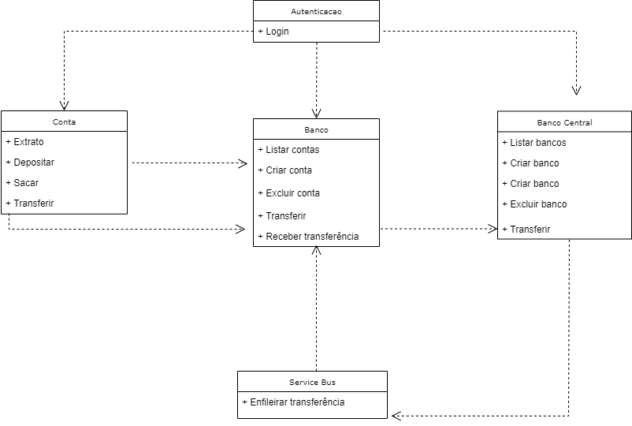

# Conta Bancária API

Desenvolvido utilizando Entity Framework Core, Swagger, JWT.



- Executar migration no namespace ContaBancaria.Data
 ```Update-Database```

- Executar o projeto ContaBancaria.ServiceBus em paralelo

